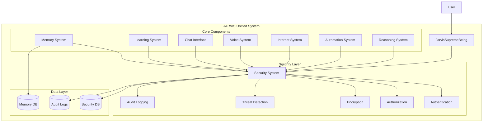

# Design Document

## Overview

The JARVIS Security Integration design provides a comprehensive security layer that seamlessly integrates with the existing JARVIS Supreme Being AI unified system. The design implements a security-first architecture where all JARVIS components operate within a secure framework that provides authentication, authorization, encryption, threat detection, and audit logging without compromising system performance or user experience.

The integration follows a layered security approach with the JarvisSecuritySystem acting as a central security service that all other JARVIS components interact with through well-defined interfaces. The design ensures backward compatibility while adding robust security features.

## Architecture

### High-Level Architecture



### Security Integration Points

1. **Initialization Layer**: Security system initializes before all other components
2. **Authentication Layer**: User authentication and session management
3. **Authorization Layer**: Permission-based access control for all operations
4. **Data Protection Layer**: Encryption for sensitive data storage and transmission
5. **Monitoring Layer**: Real-time threat detection and security event logging
6. **Audit Layer**: Comprehensive logging and compliance reporting

## Components and Interfaces

### 1. Enhanced JarvisSupremeBeing Class

The main orchestrator class will be enhanced with security integration:

```python
class JarvisSupremeBeing:
    def __init__(self):
        # Security system initializes first
        self.security_system = JarvisSecuritySystem()
        self.current_session = None
        self.security_enabled = True
        
        # Initialize other components with security context
        self.initialize_secure_components()
    
    def authenticate_user(self, username: str, password: str) -> Dict[str, Any]:
        """Authenticate user and create secure session"""
        
    def validate_access(self, operation: str, resource: str = None) -> bool:
        """Validate user access for operations"""
        
    def secure_execute(self, operation: callable, *args, **kwargs) -> Any:
        """Execute operations within security context"""
```

### 2. Security Middleware Interface

A middleware layer that intercepts all component interactions:

```python
class SecurityMiddleware:
    def __init__(self, security_system: JarvisSecuritySystem):
        self.security_system = security_system
    
    def before_request(self, session_id: str, operation: str, data: Any) -> Dict[str, Any]:
        """Pre-process all requests through security layer"""
        
    def after_request(self, session_id: str, operation: str, result: Any) -> Any:
        """Post-process all responses through security layer"""
        
    def encrypt_sensitive_data(self, data: Any, data_type: str) -> Any:
        """Encrypt sensitive data before storage/transmission"""
        
    def decrypt_sensitive_data(self, encrypted_data: Any, session_id: str) -> Any:
        """Decrypt data with proper authorization"""
```

### 3. Secure Component Wrapper

A wrapper class that adds security to existing components:

```python
class SecureComponentWrapper:
    def __init__(self, component: Any, security_system: JarvisSecuritySystem):
        self.component = component
        self.security_system = security_system
        self.required_permissions = self._get_component_permissions()
    
    def __getattr__(self, name):
        """Intercept all method calls and add security checks"""
        
    def _validate_method_access(self, method_name: str, session_id: str) -> bool:
        """Validate access to specific component methods"""
        
    def _log_component_access(self, method_name: str, session_id: str, success: bool):
        """Log all component access attempts"""
```

### 4. Enhanced Memory System Integration

The memory system will be enhanced with encryption and access control:

```python
class SecureMemorySystem(JarvisMemorySystem):
    def __init__(self, security_system: JarvisSecuritySystem):
        super().__init__()
        self.security_system = security_system
    
    def store_conversation(self, session_id: str, user_input: str, 
                          jarvis_response: str, **kwargs) -> Dict[str, Any]:
        """Store conversation with encryption and access control"""
        
    def retrieve_conversations(self, session_id: str, filters: Dict = None) -> List[Dict]:
        """Retrieve conversations with decryption and authorization"""
        
    def store_knowledge(self, session_id: str, topic: str, content: str, 
                       **kwargs) -> Dict[str, Any]:
        """Store knowledge with encryption and access logging"""
```

## Data Models

### 1. Security Session Model

```python
@dataclass
class SecuritySession:
    session_id: str
    user_id: int
    username: str
    permissions: List[str]
    created_at: datetime
    expires_at: datetime
    last_activity: datetime
    ip_address: str
    user_agent: str
    is_active: bool
```

### 2. Security Event Model

```python
@dataclass
class SecurityEvent:
    event_id: str
    event_type: str
    event_description: str
    user_id: str
    session_id: str
    ip_address: str
    timestamp: datetime
    severity: str
    component: str
    operation: str
    result: str
    additional_data: Dict[str, Any]
```

### 3. Permission Model

```python
@dataclass
class Permission:
    permission_id: str
    permission_name: str
    description: str
    component: str
    operation: str
    resource_type: str
    is_admin_only: bool
```

### 4. Encrypted Data Model

```python
@dataclass
class EncryptedData:
    data_id: int
    data_type: str
    encrypted_content: bytes
    encryption_method: str
    metadata: Dict[str, Any]
    created_at: datetime
    accessed_at: datetime
    access_count: int
    owner_user_id: int
```

## Error Handling

### 1. Security Exception Hierarchy

```python
class JarvisSecurityException(Exception):
    """Base security exception"""
    pass

class AuthenticationException(JarvisSecurityException):
    """Authentication failed"""
    pass

class AuthorizationException(JarvisSecurityException):
    """Insufficient permissions"""
    pass

class EncryptionException(JarvisSecurityException):
    """Encryption/decryption failed"""
    pass

class ThreatDetectedException(JarvisSecurityException):
    """Security threat detected"""
    pass
```

### 2. Error Handling Strategy

- **Graceful Degradation**: System continues with reduced functionality when security components fail
- **Fail-Safe Defaults**: Default to most restrictive security settings when configuration is unclear
- **Error Logging**: All security errors are logged with appropriate detail levels
- **User Feedback**: Clear, non-technical error messages for users
- **Recovery Mechanisms**: Automatic retry and recovery for transient security failures

### 3. Safe Mode Operation

When security system fails:
- Disable sensitive operations (internet access, file system operations)
- Enable read-only mode for memory and knowledge base
- Log all activities with enhanced detail
- Notify administrators of security system failure
- Provide manual security override for administrators

## Testing Strategy

### 1. Unit Testing

- **Security Component Tests**: Test each security function in isolation
- **Integration Tests**: Test security integration with each JARVIS component
- **Mock Testing**: Use mock objects to test security scenarios
- **Edge Case Testing**: Test boundary conditions and error scenarios

### 2. Security Testing

- **Penetration Testing**: Simulate attacks on the integrated system
- **Authentication Testing**: Test various authentication scenarios and edge cases
- **Authorization Testing**: Verify permission enforcement across all components
- **Encryption Testing**: Validate encryption/decryption functionality
- **Threat Detection Testing**: Test threat detection with various input patterns

### 3. Performance Testing

- **Security Overhead Testing**: Measure performance impact of security features
- **Concurrent User Testing**: Test system behavior with multiple authenticated users
- **Load Testing**: Test security system under high load conditions
- **Memory Usage Testing**: Monitor memory consumption of security components

### 4. Integration Testing

- **End-to-End Testing**: Test complete user workflows with security enabled
- **Component Interaction Testing**: Verify secure communication between components
- **Session Management Testing**: Test session lifecycle and timeout scenarios
- **Data Flow Testing**: Verify secure data flow through all system layers

### 5. Compliance Testing

- **Audit Log Testing**: Verify completeness and accuracy of audit logs
- **Data Protection Testing**: Verify encryption of sensitive data
- **Access Control Testing**: Verify proper enforcement of access controls
- **Privacy Testing**: Verify privacy protection mechanisms

### 6. Test Automation

```python
class SecurityTestSuite:
    def test_authentication_flow(self):
        """Test complete authentication workflow"""
        
    def test_authorization_enforcement(self):
        """Test permission enforcement across components"""
        
    def test_data_encryption(self):
        """Test data encryption and decryption"""
        
    def test_threat_detection(self):
        """Test threat detection capabilities"""
        
    def test_audit_logging(self):
        """Test audit log generation and integrity"""
        
    def test_session_management(self):
        """Test session creation, validation, and expiration"""
        
    def test_component_integration(self):
        """Test security integration with all JARVIS components"""
        
    def test_performance_impact(self):
        """Test performance impact of security features"""
```

### 7. Continuous Security Testing

- **Automated Security Scans**: Regular automated security testing
- **Dependency Vulnerability Scanning**: Monitor security of dependencies
- **Configuration Validation**: Regular validation of security configurations
- **Penetration Testing Schedule**: Regular professional security assessments